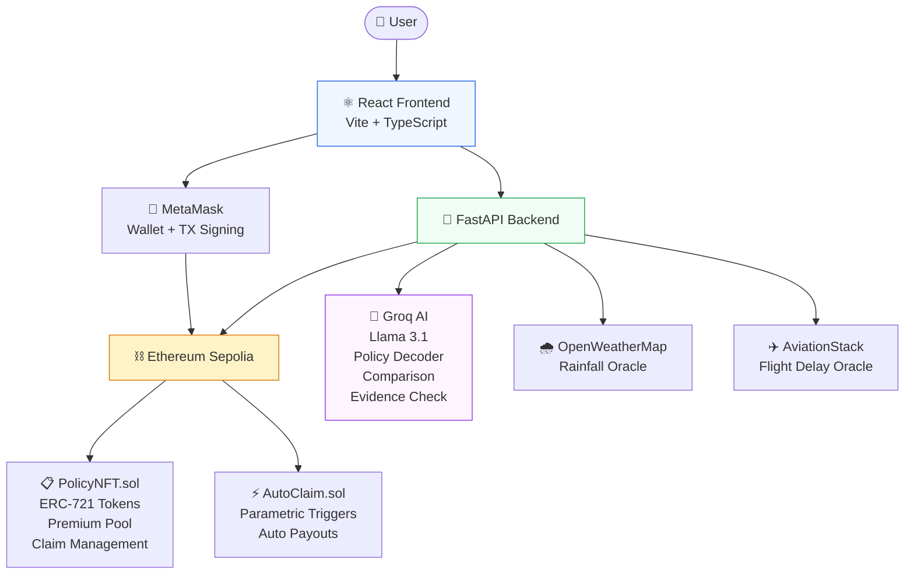

# InsureX — Decentralized Insurance Platform


> AI-powered insurance decoder meets blockchain-automated 
> claims settlement. No paperwork. No delays. No fine print surprises.

---

## What is InsureX?

InsureX is a full-stack Web3 insurance platform that solves 
two of the biggest problems in insurance:

**Problem 1 — Nobody understands their policy**
Insurance documents are written in dense legal language. 
Most people sign without understanding exclusions, trap clauses, 
or conditions that void their claims.

**Problem 2 — Claims take weeks and get rejected unfairly**
Traditional claim processing involves human reviewers who can 
delay, deny, or negotiate payouts arbitrarily.

**InsureX Solution:**
- AI reads any insurance policy and explains it in plain English
- Policies are minted as NFTs on the blockchain — immutable and owned by you
- Claims are settled automatically by smart contracts and real-world oracles
- Zero paperwork. Zero waiting. Zero human bias.

---

## Features

### AI Policy Decoder
- Paste any insurance policy document
- Llama 3.1 (via Groq) extracts coverage, exclusions, and trap clauses
- Grades the policy from A to F
- Supports English, Hindi, Tamil, Telugu, Bengali, Marathi

### Policy Comparison
- Paste two competing policies side by side
- AI compares them across 7 categories
- Shows pros, cons, gotchas, and recommends the better one

### Blockchain Policy NFTs
- Each policy is minted as an ERC-721 NFT on Ethereum
- Terms are immutable — insurer cannot change them after signing
- Policy ownership is transferable and verifiable on-chain

### Dynamic Premium Pricing
- Risk-based premium calculation engine
- Travel: destination risk + duration
- Crop: location + crop type + season
- Health: age + pre-existing conditions + lifestyle

### Parametric Auto-Claims
- File a claim with evidence
- AI verifies evidence matches the claim
- Chainlink-compatible oracles check real-world conditions:
  - Weather oracle (OpenWeatherMap) for crop insurance
  - Flight oracle (AviationStack) for travel insurance
- Smart contract executes payout automatically — no human approval

### Insurance Pool / Treasury
- Premiums collected into on-chain pool
- Real-time pool health monitoring
- Auto-pause when undercollateralized (below 20% ratio)
- Transparent solvency stats visible to all

---

## Tech Stack

| Layer | Technology |
|---|---|
| Frontend | React 18 + TypeScript + Vite |
| Styling | Tailwind CSS |
| Animations | GSAP |
| Smart Contracts | Solidity 0.8.20 (ERC-721) |
| Blockchain Dev | Hardhat |
| Web3 Connection | ethers.js v6 + MetaMask |
| AI Model | Llama 3.1 8B via Groq API |
| Weather Oracle | OpenWeatherMap API |
| Flight Oracle | AviationStack API |
| Backend | FastAPI (Python) |
| Testnet | Sepolia (Ethereum) |
| Frontend Deploy | Vercel |
| Backend Deploy | Railway |

---

## Architecture


---

## Smart Contracts

### PolicyNFT.sol
- ERC-721 policy tokens
- On-chain premium pool and treasury
- Claim filing and status tracking
- Oracle-triggered auto-payouts
- Pool health monitoring with auto-pause

### AutoClaim.sol
- Chainlink-compatible oracle integration
- Parametric trigger conditions (rainfall, flight delay)
- Batch claim checking

---

## Getting Started

### Prerequisites
- Node.js v18+
- Python 3.10+
- MetaMask browser extension
- Git

### Installation

```bash
# Clone the repository
git clone https://github.com/Shash309/InsureX.git
cd InsureX

# Install frontend dependencies
npm install

# Install backend dependencies
cd backend
pip install -r requirements.txt
cd ..
```

### Environment Setup

**Root `.env`:**
VITE_API_URL=http://localhost:8001
VITE_POLICY_NFT_ADDRESS=
VITE_AUTO_CLAIM_ADDRESS=
VITE_CHAIN_ID=31337

**`backend/.env`:**
GROQ_API_KEY=your_groq_key
OPENWEATHER_API_KEY=your_openweather_key
AVIATIONSTACK_API_KEY=your_aviationstack_key
POLICY_NFT_ADDRESS=
BLOCKCHAIN_RPC_URL=http://127.0.0.1:8545

### Running Locally

**Terminal 1 — Start local blockchain:**
```bash
npx hardhat node
```

**Terminal 2 — Deploy contracts:**
```bash
npm run deploy:local
```

**Terminal 3 — Start backend:**
```bash
cd backend
uvicorn main:app --reload --port 8001
```

**Terminal 4 — Start frontend:**
```bash
npm run dev
```

Visit `http://localhost:5173`

### MetaMask Setup
1. Add Hardhat Local network:
   - RPC URL: http://127.0.0.1:8545
   - Chain ID: 31337
   - Currency: ETH
2. Import test account using private key from hardhat node output

---

## API Endpoints

| Method | Endpoint | Description |
|---|---|---|
| POST | /decode | AI policy analysis |
| POST | /decode/multilang | Multilingual analysis |
| POST | /compare | Side-by-side comparison |
| POST | /pricing/travel | Travel premium calculation |
| POST | /pricing/crop | Crop premium calculation |
| POST | /pricing/health | Health premium calculation |
| POST | /oracle/weather | Weather oracle + auto-settle |
| POST | /oracle/flight | Flight oracle + auto-settle |
| POST | /oracle/settle | Manual oracle settlement |
| GET | /pool/stats | Treasury pool statistics |
| GET | /health | Backend health check |

---

## How Claims Work

User mints policy NFT (pays premium → joins pool)
Incident occurs (flight delay, crop failure, etc.)
User files claim on-chain (tx recorded immutably)
User uploads evidence (AI verifies it matches claim)
Oracle checks real-world data:

Weather API confirms rainfall below threshold
Flight API confirms delay beyond threshold


Smart contract executes payout automatically
ETH lands in user's wallet — no approval needed


---

## Project Structure
InsureX/
├── src/
│   ├── components/        # Reusable UI components
│   ├── pages/
│   │   ├── Home.tsx
│   │   ├── Decode.tsx     # AI Policy Decoder
│   │   ├── Compare.tsx    # Policy Comparison
│   │   ├── Dashboard.tsx  # NFT policies + treasury
│   │   └── Claim.tsx      # File claim portal
│   ├── hooks/
│   │   ├── useWallet.ts   # MetaMask connection
│   │   ├── useContract.ts # ethers.js helpers
│   │   └── usePolicy.ts   # Contract interactions
│   └── config/
│       └── contracts.ts   # Contract addresses + ABIs
├── contracts/
│   ├── PolicyNFT.sol      # Main insurance contract
│   └── AutoClaim.sol      # Oracle trigger contract
├── scripts/
│   └── deploy-and-save.js # Auto-deploy + env update
├── backend/
│   ├── main.py            # FastAPI server
│   ├── gemini.py          # AI policy decoder
│   ├── oracles.py         # Weather + flight oracles
│   └── pricing.py         # Premium calculation engine
└── test/
└── PolicyNFT.test.js  # Contract test suite

---

## Test Results
PolicyNFT Contract Tests
✅ mints a policy NFT and assigns to policyholder
✅ stores policy details correctly on-chain
✅ reverts with zero premium
✅ allows policyholder to file a claim
✅ oracle can auto-approve and pay out claim

---

## Differentiators vs Existing Solutions

| Feature | InsureX | Etherisc | Nexus Mutual | Lemonade |
|---|---|---|---|---|
| AI Policy Decoder | ✅ | ❌ | ❌ | ❌ |
| Plain English Analysis | ✅ | ❌ | ❌ | ❌ |
| Trap Clause Detection | ✅ | ❌ | ❌ | ❌ |
| Policy Comparison | ✅ | ❌ | ❌ | ❌ |
| NFT Policy Ownership | ✅ | ❌ | ❌ | ❌ |
| Auto Claims (Oracle) | ✅ | ✅ | ❌ | ❌ |
| Multi-language Support | ✅ | ❌ | ❌ | ❌ |
| Consumer Friendly UI | ✅ | ❌ | ❌ | ✅ |
| Works on ANY Policy | ✅ | ❌ | ❌ | ❌ |
| Real Weather Oracle | ✅ | ❌ | ❌ | ❌ |

---

## Roadmap

- [x] AI Policy Decoder
- [x] Policy Comparison
- [x] NFT Policy Minting
- [x] Dynamic Premium Pricing
- [x] Parametric Auto-Claims
- [x] Weather + Flight Oracles
- [x] Insurance Pool / Treasury
- [x] Multi-language Support (6 languages)
- [x] Claim Evidence Upload + AI Verification
- [ ] Sepolia Testnet Deployment
- [ ] Mobile App (React Native)
- [ ] DAO Governance
- [ ] B2B API
- [ ] Reputation System

---

## Author

**Shashwat Sharma**
- GitHub: [@Shash309](https://github.com/Shash309)
- B.Tech CSE (AI & ML) — SRM Institute of Science and Technology
- ML Engineer Intern @ Tata Steel
- Data Science Intern @ Personate AI

---

## License

MIT License — see LICENSE file for details.

---

> Built with the belief that insurance should be 
> transparent, automatic, and fair for everyone.
